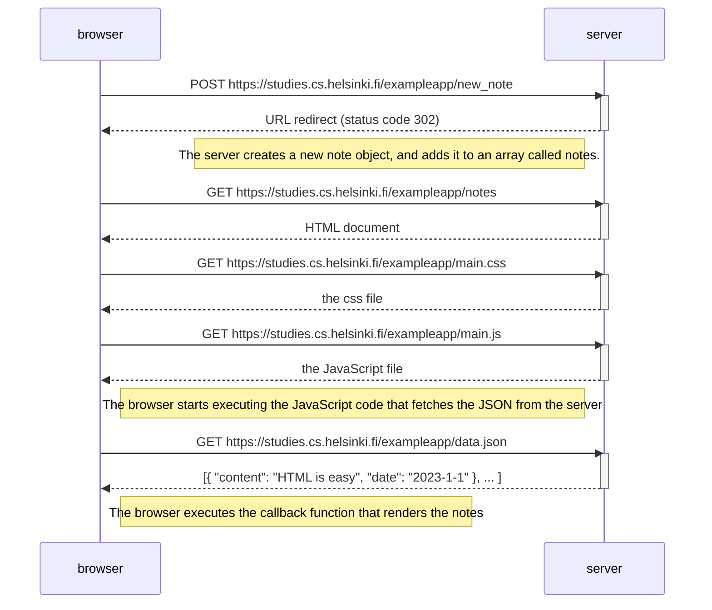
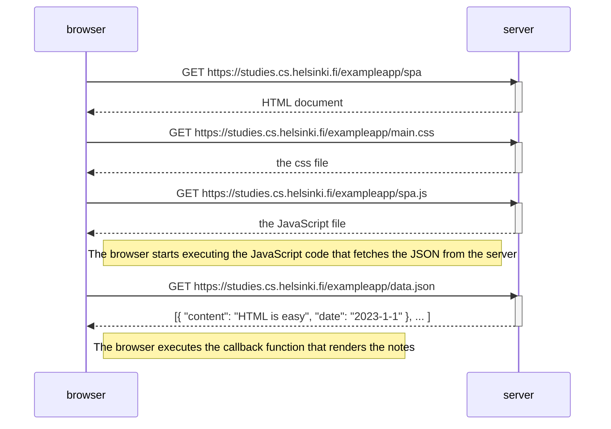
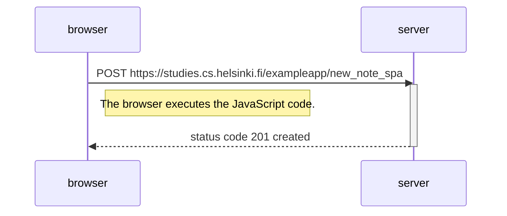

# Part 0 - Fundamentals of Web Apps

## Exercise 0.1: HTML
Review the basics of HTML by reading this tutorial from Mozilla: [HTML tutorial](https://developer.mozilla.org/en-US/docs/Learn/Getting_started_with_the_web/HTML_basics).  
  
*This exercise is not submitted to GitHub, it's enough to just read the tutorial.*

## Exercise 0.2: CSS
Review the basics of CSS by reading this tutorial from Mozilla: [CSS tutorial](https://developer.mozilla.org/en-US/docs/Learn/Getting_started_with_the_web/CSS_basics).  
  
*This exercise is not submitted to GitHub, it's enough to just read the tutorial.*

## Exercise 0.3: HTML forms
Learn about the basics of HTML forms by reading Mozilla's tutorial [Your first form](https://developer.mozilla.org/en-US/docs/Learn/HTML/Forms/Your_first_HTML_form).  
  
*This exercise is not submitted to GitHub, it's enough to just read the tutorial.*

## Exercise 0.4: New note diagram
Create a diagram depicting the situation where the user creates a new note on the page https://studies.cs.helsinki.fi/exampleapp/notes by writing something into the text field and clicking the Save button.

If necessary, show operations on the browser or on the server as comments on the diagram.

## Exercise 0.5: Single page app diagram
Create a diagram depicting the situation where the user goes to the single-page app version of the notes app at https://studies.cs.helsinki.fi/exampleapp/spa.

## Exercise 0.6: New note in Single page app diagram
Create a diagram depicting the situation where the user creates a new note using the single-page version of the app.

